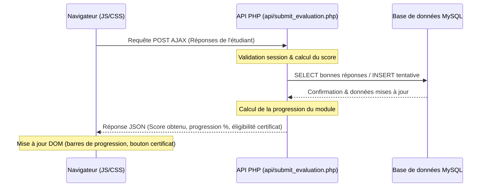

# Architecture Technique - Plateforme LMS Learn Way

Ce document présente l'architecture technique détaillée pour le développement de la plateforme **Learn Way**. Le projet est construit sur une architecture modulaire en **PHP 8+ natif**, sans framework, avec du **JavaScript Vanilla**, des requêtes asynchrones (**AJAX**) et une base de données **MySQL**.

---

## 1. Arborescence du Projet

Pour garantir la maintenabilité et la clarté du code, le projet est structuré comme suit :

```text
/home/erwin/bureau/Learnway/
├── index.php                 # Page d'accueil / Hub de connexion
├── register.php              # Page d'inscription (Étudiants et Enseignants)
├── logout.php                # Script de déconnexion et destruction de session
│
├── config/
│   └── database.php          # Connexion PDO à MySQL (learnway_db)
│
├── includes/
│   ├── auth.php              # Middleware de gestion des sessions et contrôles de rôles
│   ├── header.php            # En-tête HTML commun (Navbar, import CSS, polices)
│   ├── sidebar.php           # Sidebar dynamique basée sur le rôle de l'utilisateur
│   └── footer.php            # Pied de page HTML commun et scripts JS globaux
│
├── dashboards/
│   ├── promoteur.php         # Tableau de bord du Promoteur Learn Way
│   ├── enseignant.php        # Tableau de bord de l'Enseignant
│   └── etudiant.php          # Tableau de bord de l'Étudiant
│
├── actions/                  # Scripts PHP de traitement des formulaires (POST)
│   ├── auth_login.php        # Traitement de la connexion
│   ├── auth_register.php     # Traitement de l'inscription
│   ├── manage_modules.php    # CRUD des modules (Promoteur)
│   ├── manage_courses.php    # CRUD des cours (Enseignant)
│   ├── manage_lessons.php    # CRUD des leçons et QCM (Enseignant)
│   └── download_certificate.php # Génération et téléchargement de certificats PDF
│
├── api/                      # Endpoints PHP retournant du JSON pour AJAX (GET/POST)
│   ├── get_statistics.php    # Stats globales (Promoteur)
│   ├── get_progress.php      # Progression de l'étudiant
│   └── submit_evaluation.php # Traitement AJAX des réponses du QCM
│
├── assets/                   # Fichiers statiques
│   ├── css/
│   │   ├── style.css         # Feuille de style principale (CSS Grid, Flexbox, Variables)
│   │   └── glassmorphism.css # Utilitaires de design moderne et effets de verre
│   ├── js/
│   │   ├── app.js            # Fichier JS principal (effets visuels, toggle sidebar)
│   │   ├── ajax.js           # Gestionnaire centralisé des requêtes AJAX (Fetch API)
│   │   └── evaluation.js     # Logique interactive de passage des QCM côté client
│   └── uploads/              # Répertoires pour les fichiers téléversés
│       ├── pdf/              # Cours au format PDF
│       ├── videos/           # Cours au format vidéo (MP4)
│       └── signatures/       # Image de signature pour les certificats
│
└── vendor/                   # Bibliothèques externes légères intégrées localement
    └── fpdf.php              # Bibliothèque FPDF pour la génération native de certificats PDF
```

---

## 2. Architecture de la Base de Données & Accès aux Données

* **Technologie** : MySQL.
* **Accès PHP** : Utilisation exclusive de l'API **PDO** (PHP Data Objects).
* **Sécurité des requêtes** : Toutes les requêtes contenant des variables utilisateurs doivent obligatoirement utiliser des requêtes préparées (`prepare` et `execute`) avec typage strict pour éradiquer tout risque d'injection SQL.
* **Gestion des erreurs** : Le mode d'erreur de PDO doit être configuré sur `ERRMODE_EXCEPTION` pour faciliter le débogage via des blocs `try/catch`.

---

## 3. Flux de Données et AJAX

Afin de proposer une expérience utilisateur dynamique, fluide et sans rechargement de page intempestif, les interactions clés de Learn Way s'appuient sur l'API `fetch` d'AJAX :



---

## 4. Sécurité Globale de la Plateforme

### 4.1. Authentification et Sessions
* **Sessions sécurisées** : Les sessions PHP sont activées sur toutes les pages via `session_start()`.
* **Options de session** : Utilisation de drapeaux de sécurité pour les cookies de session dans `config/database.php` :
  ```php
  ini_set('session.cookie_httponly', 1); // Interdit l'accès JS au cookie de session
  ini_set('session.cookie_use_only_cookies', 1);
  if (isset($_SERVER['HTTPS']) && $_SERVER['HTTPS'] === 'on') {
      ini_set('session.cookie_secure', 1); // HTTPS uniquement
  }
  ```
* **Contrôle d'accès** : Un fichier `includes/auth.php` vérifie à chaque chargement de page :
  * Si l'utilisateur est authentifié.
  * Si son rôle correspond aux droits requis par le tableau de bord (Promoteur, Enseignant, Étudiant). Dans le cas contraire, une redirection automatique vers `index.php` est déclenchée.

### 4.2. Protection CSRF (Cross-Site Request Forgery)
* Un jeton unique (token CSRF) est généré dans la session de l'utilisateur à sa connexion.
* Ce jeton est injecté dans chaque formulaire via un champ caché et transmis dans les en-têtes AJAX.
* Les scripts d'action vérifient systématiquement la correspondance du jeton avant de traiter une requête de modification de données.

### 4.3. Téléchargements Sécurisés (Uploads)
* Pour éviter le téléversement de fichiers malveillants, les fichiers téléchargés par les enseignants feront l'objet de vérifications strictes :
  * **Type MIME** : Seuls les fichiers `application/pdf` et les extensions vidéo `video/mp4` sont acceptés.
  * **Taille** : Limite stricte définie dans PHP (ex: 50 Mo pour les vidéos, 10 Mo pour les PDF).
  * **Nommage** : Les fichiers téléchargés sont renommés de manière unique à l'aide d'un identifiant généré aléatoirement (`uniqid()`) pour éviter d'écraser des fichiers existants ou de révéler la structure originale des répertoires.

---

## 5. Mécanisme de Génération des Certificats

Le certificat est un document PDF généré dynamiquement côté serveur.

* **Outil** : **FPDF** (choisi pour sa légèreté et sa capacité à s'exécuter dans des environnements contraints sans dépendances lourdes).
* **Fonctionnement** :
  1. Lorsqu'un étudiant clique sur "Télécharger mon certificat" pour un module validé, `actions/download_certificate.php` est appelé.
  2. Le script vérifie la progression globale de l'étudiant pour s'assurer qu'elle est bien égale à 100 %.
  3. Le script récupère le numéro de certificat unique de l'étudiant (créé lors de la validation finale dans la table `certifications`).
  4. FPDF assemble la maquette graphique :
     * Cadre et arrière-plan professionnel aux couleurs de **Learn Way**.
     * Ajout des textes : Nom de l'étudiant, nom du module, date d'obtention, numéro de certificat unique.
     * Insertion de l'image de la signature numérique du promoteur.
  5. Le document est servi directement au navigateur avec les en-têtes HTTP de téléchargement forcé (`Content-Disposition: attachment`).
