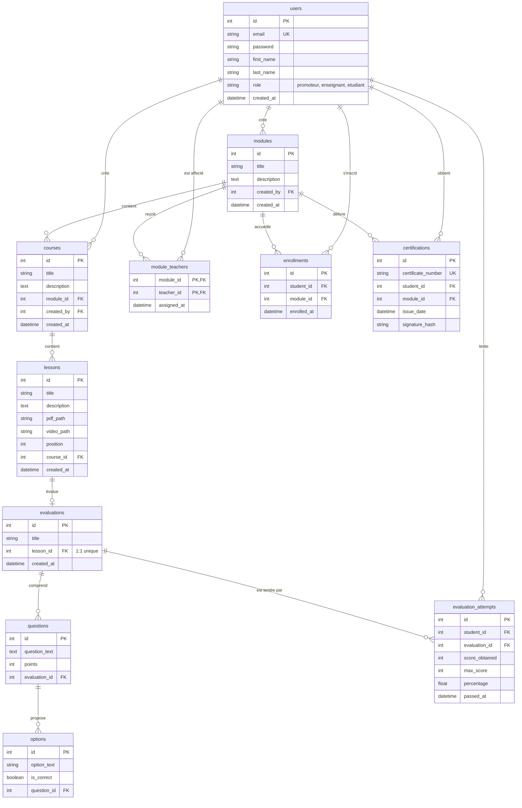

# Structure de la Base de Données - Learn Way

Ce document présente la conception de la base de données relationnelle MySQL pour la plateforme **Learn Way**. Le nom de la base de données est `learnway_db`.

---

## 1. Modèle Conceptuel des Données (MCD)

Le MCD modélise les entités métier de la plateforme et leurs associations :

* **UTILISATEUR** (0,N) <--- **Attribuer** ---> (0,N) **MODULE** : Un module est enseigné par un ou plusieurs enseignants. Un enseignant peut intervenir dans plusieurs modules.
* **UTILISATEUR** (0,N) <--- **Inscrire** ---> (0,N) **MODULE** : Un étudiant peut s'inscrire à plusieurs modules. Un module accueille plusieurs étudiants.
* **UTILISATEUR** (1,N) <--- **Créer_Module** ---> (1,1) **MODULE** : Un module est créé par un unique promoteur. Un promoteur peut créer plusieurs modules.
* **UTILISATEUR** (1,N) <--- **Créer_Cours** ---> (1,1) **COURS** : Un cours est rédigé par un unique enseignant. Un enseignant peut rédiger plusieurs cours.
* **MODULE** (1,N) <--- **Contenir_Cours** ---> (1,1) **COURS** : Un cours appartient à un seul module. Un module contient un ou plusieurs cours.
* **COURS** (1,N) <--- **Contenir_Lecon** ---> (1,1) **LECON** : Une leçon appartient à un seul cours. Un cours est composé d'une ou plusieurs leçons.
* **LECON** (1,1) <--- **Evaluer** ---> (0,1) **EVALUATION** : Une leçon possède au plus une évaluation (QCM). Une évaluation appartient à une seule leçon.
* **EVALUATION** (1,N) <--- **Poser** ---> (1,1) **QUESTION** : Une question appartient à une seule évaluation. Une évaluation comporte une ou plusieurs questions.
* **QUESTION** (1,N) <--- **Proposer** ---> (1,1) **OPTION** : Une option de réponse appartient à une seule question. Une question propose au moins deux options.
* **UTILISATEUR** (0,N) <--- **Tenter** ---> (0,N) **EVALUATION** : Un étudiant effectue une ou plusieurs tentatives d'évaluation.
* **UTILISATEUR** (0,N) <--- **Certifier** ---> (0,1) **MODULE** : Un étudiant obtient au plus un certificat par module.

---

## 2. Diagramme Entité-Relation (Mermaid)

Voici la représentation graphique des tables et de leurs relations :

---

## 3. Modèle Logique des Données (MLD) et Schéma Relationnel

Le schéma relationnel traduit les entités et associations du MCD en tables avec clés primaires (PK) et clés étrangères (FK) :

1. **users** (<u>id</u>, email, password, first_name, last_name, role, created_at)
2. **modules** (<u>id</u>, title, description, #created_by, created_at)
   * *#created_by* référence *users(id)*.
3. **courses** (<u>id</u>, title, description, #module_id, #created_by, created_at)
   * *#module_id* référence *modules(id)*.
   * *#created_by* référence *users(id)*.
4. **lessons** (<u>id</u>, title, description, pdf_path, video_path, position, #course_id, created_at)
   * *#course_id* référence *courses(id)*.
5. **evaluations** (<u>id</u>, title, #lesson_id, created_at)
   * *#lesson_id* référence *lessons(id)* (contrainte UNIQUE pour garantir la relation 1:1).
6. **questions** (<u>id</u>, question_text, points, #evaluation_id)
   * *#evaluation_id* référence *evaluations(id)*.
7. **options** (<u>id</u>, option_text, is_correct, #question_id)
   * *#question_id* référence *questions(id)*.
8. **module_teachers** (<u>#module_id</u>, <u>#teacher_id</u>, assigned_at)
   * *#module_id* référence *modules(id)* (clé primaire composée).
   * *#teacher_id* référence *users(id)* (clé primaire composée).
9. **enrollments** (<u>id</u>, #student_id, #module_id, enrolled_at)
   * *#student_id* référence *users(id)*.
   * *#module_id* référence *modules(id)*.
   * Contrainte UNIQUE sur le couple (`student_id`, `module_id`).
10. **evaluation_attempts** (<u>id</u>, #student_id, #evaluation_id, score_obtained, max_score, percentage, passed_at)
    * *#student_id* référence *users(id)*.
    * *#evaluation_id* référence *evaluations(id)*.
11. **certifications** (<u>id</u>, certificate_number, #student_id, #module_id, issue_date, signature_hash)
    * *#student_id* référence *users(id)*.
    * *#module_id* référence *modules(id)*.
    * Contrainte UNIQUE sur le couple (`student_id`, `module_id`).

---

## 4. Dictionnaire des Tables et Contraintes

### 4.1. Table `users`
Stocke les comptes de tous les utilisateurs (promoteurs, enseignants et étudiants).
* **role** : Limité par une contrainte de type `ENUM` : `'promoteur'`, `'enseignant'`, `'etudiant'`.
* **email** : Index unique pour empêcher l'inscription de comptes doublons.

### 4.2. Table `evaluation_attempts`
Enregistre chaque tentative d'évaluation d'un étudiant.
* **percentage** : Stocke la progression de l'étudiant à la leçon associée. Cette valeur est calculée dynamiquement comme : `(score_obtained / max_score) * 100`.
* **passed_at** : Horodatage de la tentative.

### 4.3. Table `certifications`
Enregistre les certificats émis.
* **certificate_number** : Clé unique générée automatiquement pour identifier le certificat.
* **signature_hash** : Empreinte cryptographique (SHA-256) garantissant l'authenticité du certificat à partir des données de l'étudiant et du module.
